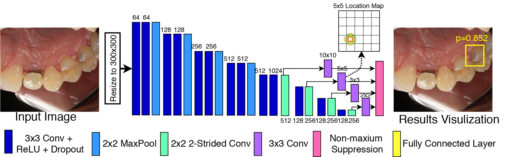

# Development and Evaluation of Deep Learning for Screening Dental Caries from Oral Photos


This repository contains Pytorch implementation of a deep-learning-based detection model for localizing dental caries from oral photos. 
The multiple-GPU-based training/testing and CPU/single-GPU-based deployment are supported by this implementation. 


## Installation Guide
Our implementation only depends on `Pytorch` and `mmcv`. 

### Step 1: Clone the repository
```
$ git clone https://github.com/liangyuandg/DLCariesScreen.git
```

### Step 2: Install dependencies
**Note**: The implementation is built and tested under `Python3.6`.

**Note**: If you are using a Python virtualenv, make sure it is activated before running each command in this guide.

Install PyTorch by following the [official guidance](https://pytorch.org/). 

Install mmcv, which is a versatile image processing library designed for computer vision research, by following the [official guidance](https://github.com/open-mmlab/mmcv).

### Step 3: Download the pre-trained model weights
Download the model weights from [here](https://drive.google.com/file/d/1CzEkQ7mR63GsCDfRRBViYhGEZIS1aOCF/view?usp=sharing) and place it in the `checkpoints` directory.


## Instructions
The implementation supports multi-GPU-based training and testing for efficiency. The implementation also supports single-GPU-based or CPU-based inference for the deployment, e.g., on a model server or on edge. 

### Training
The implementation assumes a [COCO-style](https://cocodataset.org/#format-data) json file for logging the raw image and annotation information. 

First, convert the json-formatted annotation file into pickle-formatted that is supported by the training, using `datasets/json_to_pickle.py`. Splitting the entries into training/validation/testing according to your experiment designs. 

Second, set the paths for image repository, pickle-formatted annotation file, working directory, pre-trained model in `engines/engine_train_VGGSSD`. Other training parameters for augmentations, batching, learning, and etc. can also be modified in the header part of the file. 

Third, start trianing process by running the bash `engines/engine_train_multiple_GPU.sh`. 

### Testing and Evaluation

First, obtain the pickle-formatted annotation file similar as in the training procedure. 

Second, set the paths for model checkpoint file, pickle-formatted annotation file, working directory, image repository in `engines/engine_infer_VGGSSD`. 

Third, start testing inference by running the bash `engines/engine_infer_multiple_GPU.sh`. 

For numerical evaluation, use the function provided in `evaluation/boxwise_relaxed_froc.py` for localization related results; Use the function provided in `evaluation/imagewise_roc.py` for classification related results. 

### Deployment

First, set the paths for the testing image, model checkpoint file, and results storing in `deployment/engine_infer_Detection_single_GPU_draw_box.py`. 

Second, run `deployment/engine_infer_Detection_single_GPU_draw_box.py` for the single image inference and result visualization. 

We give an example input image and its inference result in the `deployment` folder.


## Notes
1. More details about training strategy, model architecture descriptions, and result discussion should refer to the following [paper](https://onlinelibrary.wiley.com/doi/full/10.1111/odi.13735). If you find the work has helped you for your research, please consider citing : 
```
@article{zhang2020development,
  title={Development and evaluation of deep learning for screening dental caries from oral photos},
  author={Zhang, Xuan and Liang, Yuan and Li, Wen and Liu, Chao and Gu, Deao and Sun, Weibin and Miao, Leiying},
  journal={Oral diseases},
  year={2020},
  publisher={Wiley Online Library}
}
```

2. Since the privacy issue and commercial interest, the dataset is not released at the moment. ~~Request for the data should be made to liangyuandg@ucla.edu and will be considered according to the purpose of usage.~~ By following the instructions above, new models can be trained on any individual's repository of data.

**[Update]** As of Dec. 28th, 2020, the dataset has not yet been public for de-identification and privacy need. Please contact with Prof. Leiying Miao for the latest status of the dataset. 

Miao, Leiying\
Medical School of Nanjing University\
[https://med.nju.edu.cn/84/4a/c10886a230474/pagem.htm](https://med.nju.edu.cn/84/4a/c10886a230474/pagem.htm)\
Email: [miaoleiying80@163.com](mailto:miaoleiying80@163.com)


